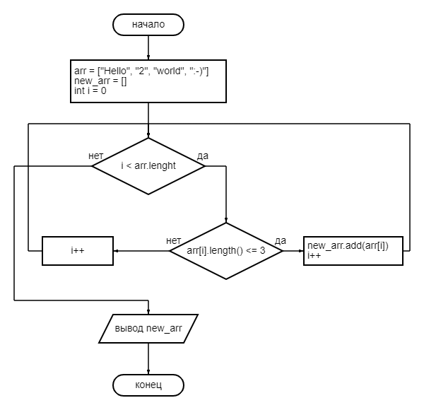

# Итоговая контрольная работа по основному блоку

## которая из имеющегося массива строк формирует новый массив из строк, длина которых меньше, либо равна 3 символам

### Программа выполнена на языке Java

#### **Примеры:**
#### **[“Hello”, “2”, “world”, “:-)”] → [“2”, “:-)”]**
#### **[“1234”, “1567”, “-2”, “computer science”] → [“-2”]**
#### **[“Russia”, “Denmark”, “Kazan”] → []**

### Ниже представлена блок-схема алгоритма:

